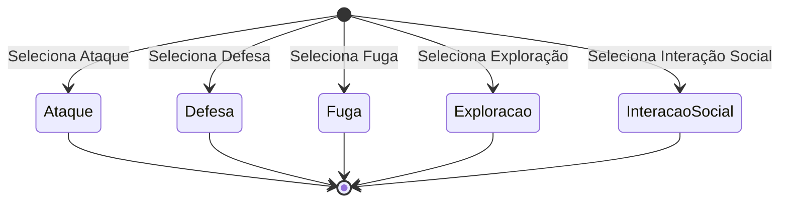

# Implementação do Padrão Strategy no Comportamento de Personagens

Este repositório é responsável por armazenar o código-fonte e a documentação do trabalho 5 da disciplina Técnicas de Programação. A aplicação a seguir implementa o padrão Design Pattern Strategy em Java, resolvendo um problema com um contexto específico, buscando demonstrar como este padrão pode ser usado para aumentar a flexibilidade e a reutilização de código.

## Contexto
Em um jogo de RPG, os personagens podem adotar diferentes comportamentos dependendo das situações encontradas como, por exemplo, uma situação de combate, em que é necessário defender ou atacar. Com isso, a complexidade aumenta quando o comportamento dos personagens deve mudar dinamicamente com base no estado do jogo ou nas escolhas do usuário, ou seja, o comportamento de cada personagem deve ser adaptável conforme a situação atual. 

### Problema vs Solução
**Problema Principal**: Como gerenciar e mudar o comportamento de um personagem de forma flexível e dinâmica, sem a necessidade de modificar o código existente ou adicionar complexidade excessiva ao sistema, sendo capaz de reutilizar o código?

**Solução**: Para isso, podemos implementar diferentes estratégias de comportamento que podem ser alteradas conforme necessário (Padrão Strategy).


<p align="center">

</p>

## Descrição da escolha do design 

Para implementar o comportamento de um personagem nessa aplicação, foi necessário identificar e definir as ações que o personagem pode realizar em diferentes situações. Cada ação é representada por uma estratégia, que permite ao personagem adaptar seu comportamento conforme o contexto. Os comportamentos identificados são:
- *Ataque*: Esta estratégia define como o personagem deve atacar. Pode incluir diferentes tipos de ataques ou abordagens.
- *Defesa*: Esta estratégia define como o personagem deve se defender. Pode incluir diferentes métodos de defesa ou esquivas.
- *Fuga*: Esta estratégia define como o personagem deve fugir ou se retirar de uma situação perigosa.
- *Exploração*: Descreve o comportamento do personagem ao explorar o ambiente em busca de itens ou informações.
- *Interação Social*: Refere-se à forma como o personagem interage com NPCs ou outros personagens.

### Uso do Padrão Strategy:

Ao usar o Design Pattern Strategy permitimos que o comportamento de um personagem seja alterado dinamicamente sem alterar o código do personagem ou do sistema, ou seja, este padrão é utilizado para encapsular cada comportamento específico em classes distintas, que implementam uma interface comum. No caso desta aplicação, a escolha do design e deste padrão se deu pelos seguintes fatores: 
- **Estratégias**: Cada comportamento é encapsulado em uma classe que implementa uma interface. Permite que diferentes comportamentos sejam definidos e aplicados de forma intercambiável.
- **Interface**: Define um método que deve ser implementado por todas as classes de comportamento. No código-fonte, é o método ```executar_comportamento()```.
- **Classes Concretas (ComportamentoAtacar, ComportamentoDefender, etc.)**: Implementam a lógica específica para cada comportamento.
- **Classe Personagem**: Usa uma instância de Comportamento para executar o comportamento atual. 
- **Interface para o Usuário**: Fornece uma maneira simples de selecionar e aplicar diferentes comportamentos ao personagem.


## Estrutura do Projeto
- Implementar a interface da estratégia, que definirá um método comum para todas as estratégias.
- Criar ao menos três classes concretas que implementem diferentes estratégias para resolver o problema proposto.
- Desenvolver uma classe de contexto que utilize a interface da estratégia para aplicar diferentes estratégias de forma intercambiável.
- Implementar uma interface para o usuário (simples) que permita selecionar e aplicar diferentes estratégias em tempo de execução.

## Testes realizados

## Instruções para execução
- Instalar o java
- baixar o repo
- executar no terminal
